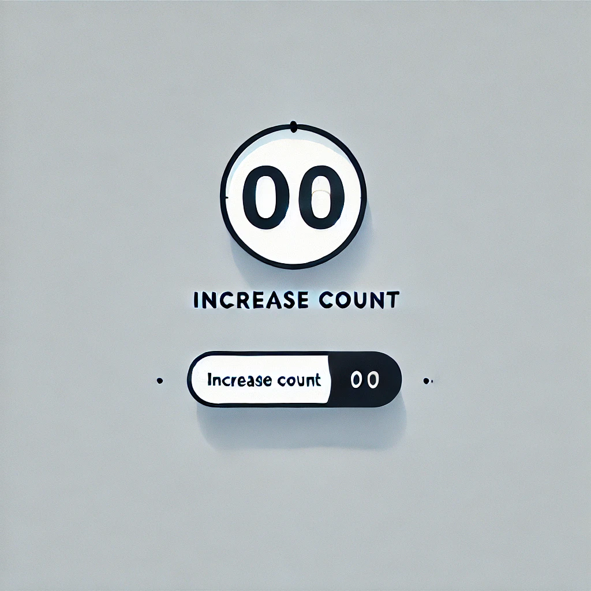
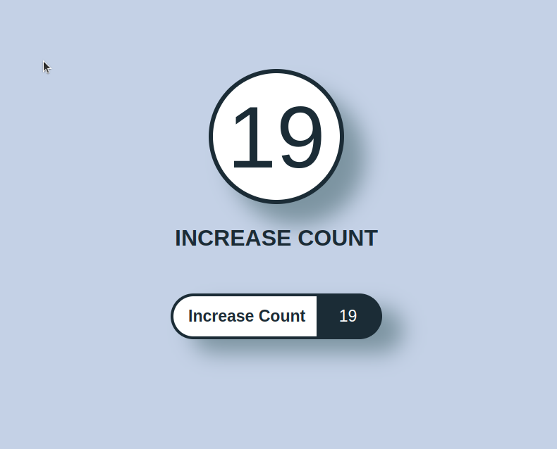

# Contador de clics
*** Objetivo: *** Muestra un número en la pantalla que comienza en 0 y aumenta cada vez que se presiona un botón.

*** Pistas: ***

* Usa una variable para almacenar el conteo.
* Modifica el contenido de un 
 con innerText o textContent.

|Imagen Referencia|Imagen Resultado|
|-----------------|----------------|
|  |  | 
